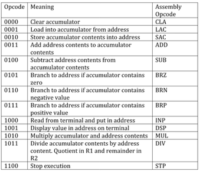

# Assembler Documentation

## Usage Instructions
`python3 Assembler.py <name_of_assembly_file>`

## Syntax

## A Few Considerations
1. A label must immediately be followed by a colon ':'. A line cannot be blank after a label.
2. CLA and STP don't take any arguments.
3. Rest of the opcodes take exactly one argument.
4. Variables and labels must not have same names as opcodes. [Reason: Opcodes are treated as keywords.]
5. START and END directives, are not supported. [Reason: Not present in the project specifications.]
6. Comments start with '#' and are treated as such till the end of the line.

## Working

1. Assembly code is read from specified file.

2. All empty lines are stripped.

3. First Pass
  (a) Location counter is initialised.
  (b) Line of code is parsed.
  (c) If a label is present, it is added into the symbol table or error is reported accordingly.
  (d) Opcode is checked to be of correct syntax. If not, error is reported.
  (e) Number of arguments of opcodes is checked to be correct. If not, error is reported.
  (f) If an argument is legal, it is checked to not be a keyword and be of correct type. If not, error is reported.
  (g) If the argument is a label, it is added into the symbol table for forward referencing resolution if not defined yet.
  (h) If the argument is a variable, it is added into the symbol table or error is reported accordingly.
  (i) Location counter is incremented.
  (j) Repeat steps (b) to (i) for all lines of code.

4. If errors were encountered, execution stops.

5. Second Pass
  (a) Parse the line of code.
  (b) Replace the opcode with its machine code equivalent.
  (c) Replace the address of the variable/label (if absent, its taken as 0) with its binary representation.
  (d) Repeat steps (a) to (c) for all lines of code.

6. Symbol table is printed.

7. Object code is printed.

Note: Virtual address mapping starts from 1.
Note: All variables are 'word'-size.
Note: The value of the variables is never considered, just their addresses.

## Error Reporting

Errors are reported in red color on the terminal.

They are the following:
Absent STP, Wrong Syntax, Label not Defined, Wrong no of arguments and so on.

Note: All line numbers reported are in after stripping blank lines from the data read from the file.
      Hence, kindly take that into account.

Note: Errors may cascade, that is, it might happen that error in line x lead to errors being reported in lines after x too.
      This is due to the fact that all possible errors are reported and hence, don't stop when an error is encountered.
      Kindly take that into account.
